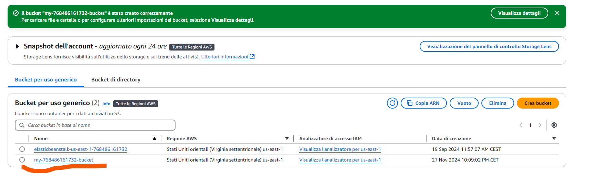
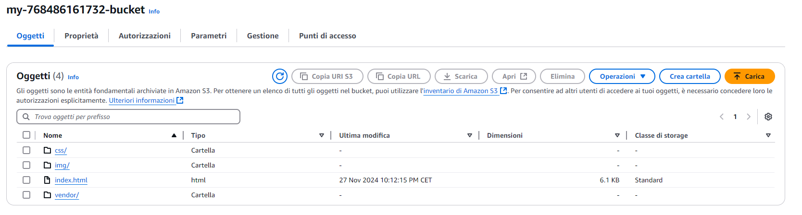
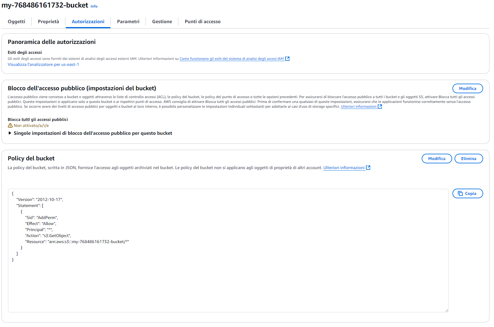
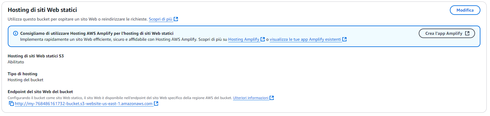
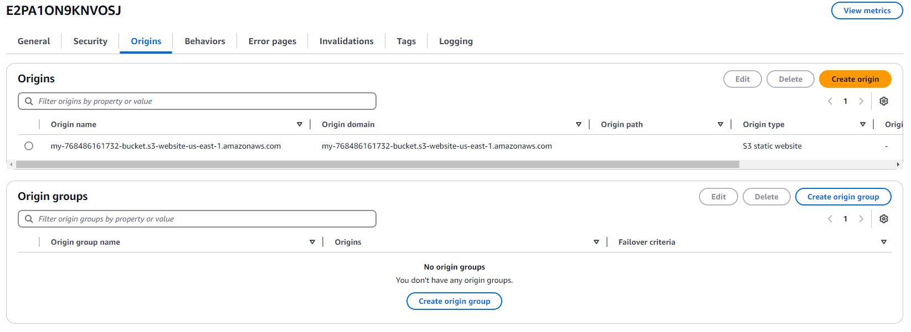
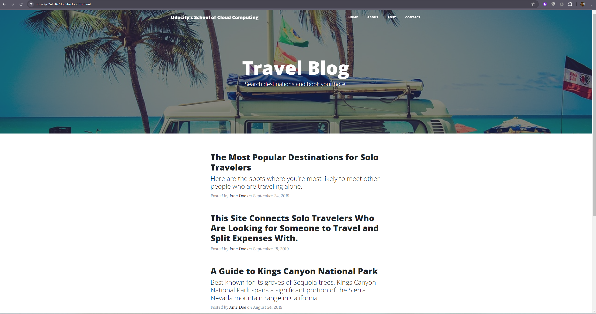
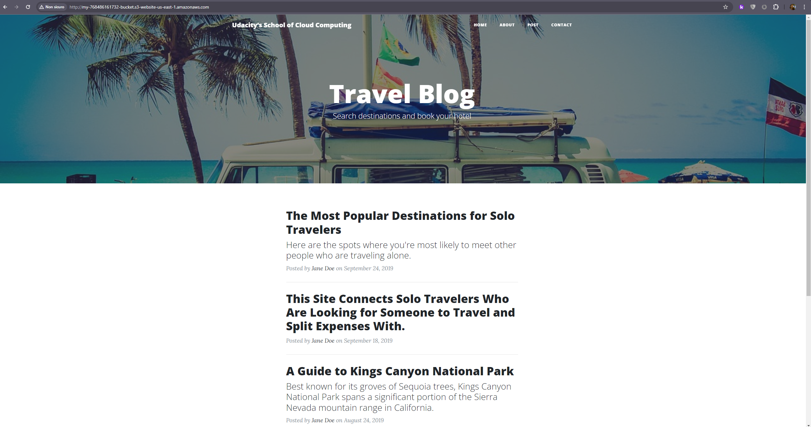
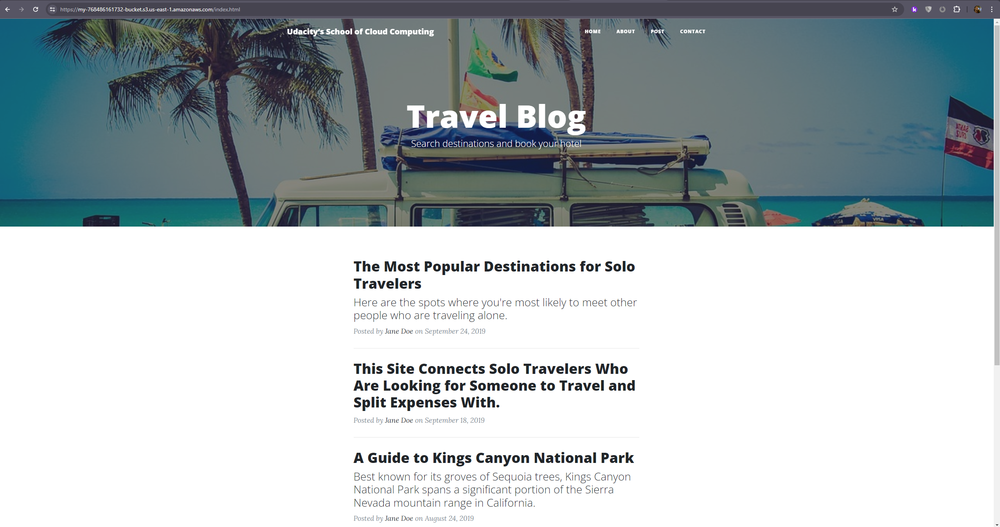

# Static Website Hosting on AWS

This project demonstrates how to host a static website using **Amazon S3** and optimize its delivery using **Amazon CloudFront**. The project is designed to help you learn the basics of static website hosting and content delivery on AWS.

---

## Project Overview

This project focuses on deploying a static website that includes **HTML**, **CSS**, and **JavaScript** files. These files require no server-side processing, making the cloud an ideal environment for hosting. 

## Prerequisites

- Download the **starter code**: [Click here to download](https://video.udacity-data.com/topher/2020/May/5ecea462_udacity-starter-website/udacity-starter-website.zip) (Ensure to unzip the file before proceeding).
- Familiarity with basic AWS services (S3 and CloudFront).

### Objectives
1. **Host a static website** on Amazon S3.
2. **Use CloudFront** to access cached website pages, ensuring:
   - **Low latency** during rendering.
   - **High transfer speeds**.

### Key Considerations
- Static website hosting on S3 requires a **public bucket**.
- CloudFront can operate with both **public** and **private buckets**, enhancing security and performance.

---

## Steps to Deploy the Website

### 1. **Create an S3 Bucket**
- 1.1 Navigate to the “AWS Management Console” page, type “S3” in the “Find Services” box and then select “S3”.
- 1.2 The Amazon S3 dashboard displays. Click “Create bucket”.
- 1.3 In the General configuration, enter a “Bucket name” and a region of your choice(One of the convenient naming conventions is my-123456789-bucket, where you can replace 123456789 with your 12 digit AWS account ID).
- 1.4 In the Bucket settings for Block Public Access section, uncheck the “Block all public access”. It will enable the public access to the bucket objects via the S3 object URL.


### 2. **Upload files to S3 Bucket**
- 2.1 Once the bucket has been created, click the “Upload” button.
- 2.2 Click the "Add files" and “Add folder” button, and upload the Student-ready starter code(opens in a new tab) folder content from your local computer to the S3 bucket.


### 3. **Secure Bucket via IAM**
- 3.1 Click on the “Permissions” tab.
- 3.2 Enter the following bucket policy replacing your-website with the name of your bucket and click “Save”.
```json
{
  "Version":"2012-10-17",
  "Statement":[
    {
      "Sid":"AddPerm",
      "Effect":"Allow",
      "Principal": "*",
      "Action":["s3:GetObject"],
      "Resource":["arn:aws:s3:::your-website/*"]
    }
  ]
}
```


### 4. **Configure S3 Bucket**

- 4.1 Go to the Properties tab and then scroll down to edit the Static website hosting section.
- 4.2 Click on the “Edit” button to see the **Edit static website hosting** screen. Now, enable the **Static website hosting**, and provide the default home page and error page for your website.
- 4.3 For both “Index document” and “Error document”, enter “index.html” and click “Save”. After successfully saving the settings, check the Static website hosting section again under the Properties tab. You must now be able to view the website endpoint:


### 5. **Distribute Website via CloudFront**

- 5.1 Select “Services” from the top left corner and enter “cloudfront” in the “Find a service by name or feature” text box and select “CloudFront”.
- 5.2 From the CloudFront dashboard, click “Create Distribution”.
- 5.3 Use the following details to create a distribution:

|Field|Value|
|---------|-------------|
|Origin > Domain Name|Don't select the bucket from the dropdown list. Paste the Static website hosting endpoint of the form `<bucket-name>.s3-website-region.amazonaws.com`|
|Origin > Enable Origin Shield|No|
|Default cache behavior|Use default settings|
|Cache key and origin requests|Use default settings|

- 5.4 Leave the defaults for the rest of the options, and click “Create Distribution”. It may take up to 10 minutes for the CloudFront Distribution to get created.

- 5.5 Once the status of your distribution changes from “In Progress” to “Deployed”, copy the endpoint URL for your CloudFront distribution found in the “Domain Name” column.


### 6. **Access Website in Web Browser**

- 6.1 Open a web browser like Google Chrome, and paste the copied CloudFront domain name without appending /index.html at the end:
https://d2nln167do35hi.cloudfront.net/


- 6.2 Access the website via website-endpoint:
http://my-768486161732-bucket.s3-website-us-east-1.amazonaws.com/


- 6.3 Access the bucket object via its S3 object URL:
https://my-768486161732-bucket.s3.us-east-1.amazonaws.com/index.html
